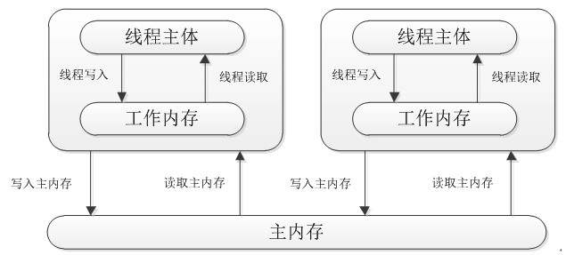

# 多线程的变量可见性问题
## 变量可见性问题的起因
JVM中存在一个主存区（Main Memory或Java HeapMemory），对于所有线程进行共享，而每个线程又有自己的工作内存（Working Memory），工作内存中保存的是主存中某些变量的拷贝，线程对所有变量的操作并非发生在主存区，而是发生在工作内存中，而线程之间是不能直接相互访问，变量在程序中的传递，是依赖主存来完成的。具体的如下图所示：


## 一个变量可见性问题的例子
代码如下：
``` java
private static boolean i = true;

public static void main(String[] args) throws InterruptedException {

    Thread thread1 = new Thread(new Runnable() {
        @Override
        public void run() {
            while (i) {
                    Object object = new Object();
            }

            System.out.println("tA out");
        }
    }, "tA");

    thread1.start();
    Thread.sleep(1_000);
    i = false;

    System.out.println("out");
}
```
具体能不能复现变量可见性问题，依赖于jvm的行为，
目前已知测试
循环体内为空的时候不停
循环体内为 Object obj = new Object(); 的时候不停
循环体内为 System.out.println(); 的时候停
循环体内为 Thread.sleep(1000); 的时候停
循环体内为 File file = new File("C:\work\test.txt"); 的时候停

## volatile
将变量i用volatile修饰，能够确保变量i在各个线程间的可见性。
但是volatile不能保证原子性。
