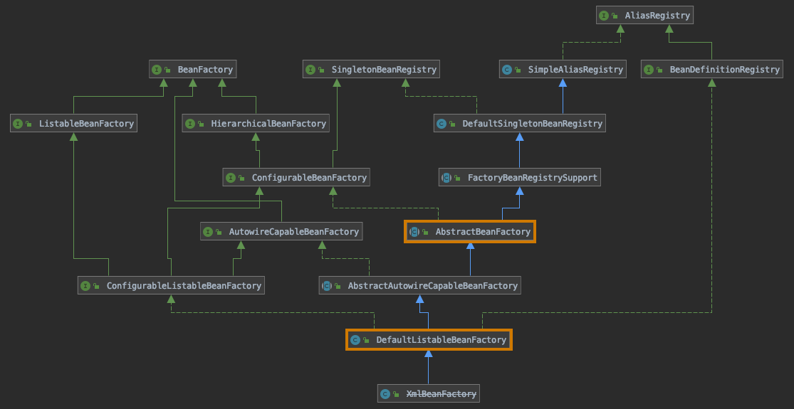

# bean的加载

[TOC]

## getBean方法

getBean是 AbstractBeanFactory 这个抽象类的一个方法，下面是它在相关类的uml图中的位置：



核心逻辑是调用 doGetBean 方法，下面分阶段分析 doGetBean 方法的执行流程

### 1. 转换 beanName

因为传入 doGetBean 方法的 name 除了 beanName 之外，还可能是 别名 或 FactoryBean，这个方法的目的就是从 name 中获得实际的 beanName。

核心方法：AbstractBeanFactory 的 transformedBeanName 方法

``` java
protected String transformedBeanName(String name) {
		return canonicalName(BeanFactoryUtils.transformedBeanName(name));
	}
```

第一步，使用 BeanFactoryUtils.transformedBeanName 工具方法去除 FactoryBean 的 "&" 前缀。

第二步，调用父类 SimpleAliasRegistry 的 canonicalName 方法，根据别名获得 beanName。

### 2. 尝试从缓存中加载单例

核心方法：父类 DefaultSingletonBeanRegistry 的 getSingleton 方法

具体加载步骤在 代码注释中标出：

``` java
protected Object getSingleton(String beanName, boolean allowEarlyReference) {
  // 1. 尝试从 singletonObjects 中加载 bean
	Object singletonObject = this.singletonObjects.get(beanName);
	if (singletonObject == null && isSingletonCurrentlyInCreation(beanName)) {
		synchronized (this.singletonObjects) {
      // 2. 尝试从 earlySingletonObjects 中加载 bean
			singletonObject = this.earlySingletonObjects.get(beanName);
			if (singletonObject == null && allowEarlyReference) {
        // 3. 尝试从 singletonFactories 中获取 bean 的 objectFactory
				ObjectFactory<?> singletonFactory = this.singletonFactories.get(beanName);
				if (singletonFactory != null) {
          // 4. 使用 objectFactory 创建 bean
					singletonObject = singletonFactory.getObject();
          // 5. 将创建的 bean 更新到另外两个缓存 map 中
					this.earlySingletonObjects.put(beanName, singletonObject);
					this.singletonFactories.remove(beanName);
				}
			}
		}
	}
	return singletonObject;
}
```

对三个缓存 map 的说明：
1. singletonObjects 保存已经创建的 bean
2. earlySingletonObjects 保存的 bean 可能还在创建中，bean 可能还在创建过程中
3. singletonFactories 保存 bean 的工厂方法


[上一页](./index.md)